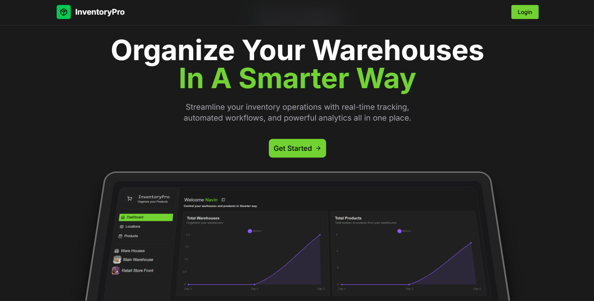
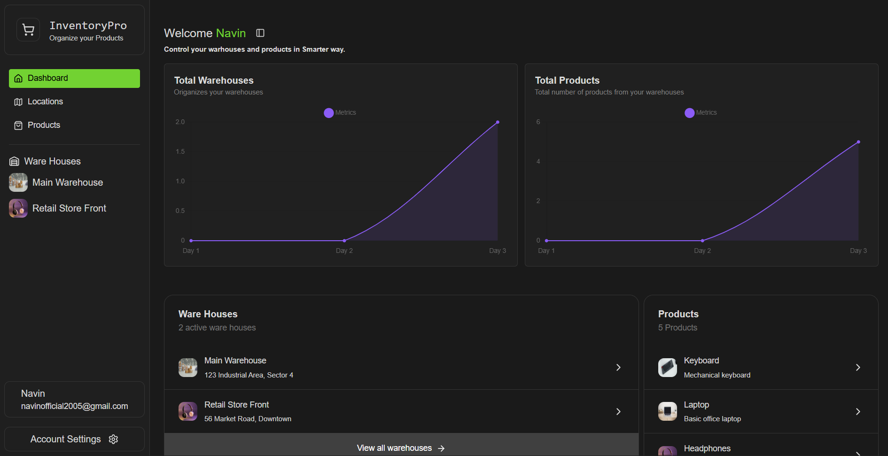
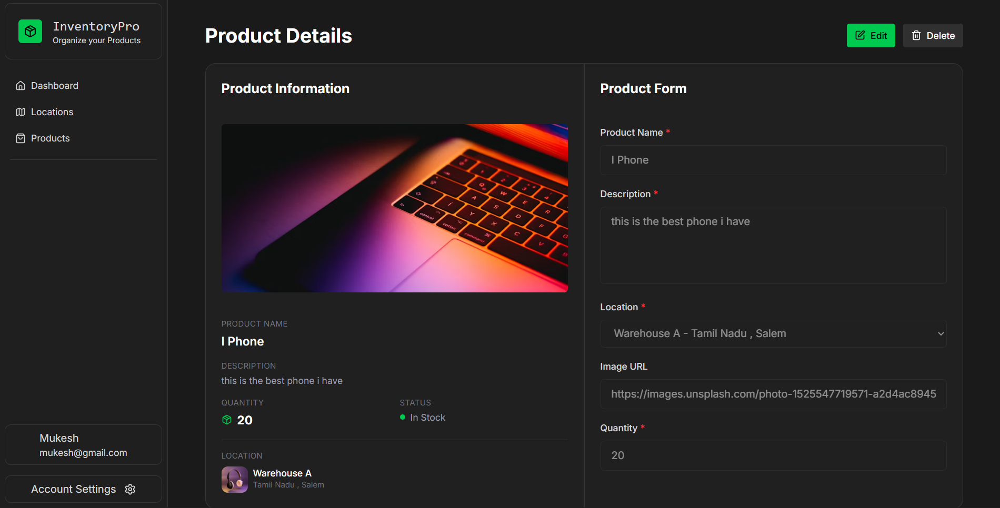
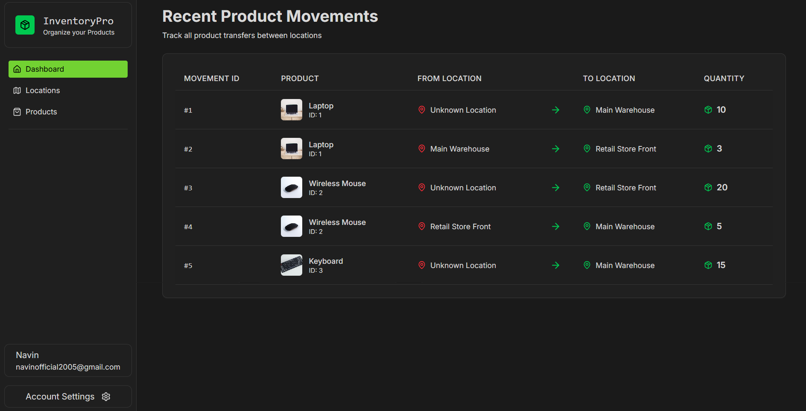

# Inventory App

A modern, full-stack inventory management application built with Next.js and Flask.
###
Live Link :  https://inventory-app-flask-web.onrender.com/
###

Screen Shots







## Tech Stack

### Frontend
- **Framework**: [Next.js](https://nextjs.org/)
- **Styling**: [Tailwind CSS](https://tailwindcss.com/)
- **UI Components**: [Radix UI](https://www.radix-ui.com/) / [Shadcn UI](https://ui.shadcn.com/)
- **State Management & Data Fetching**: React Hooks, Axios

### Backend
- **Framework**: [Flask](https://flask.palletsprojects.com/)
- **Database**: SQLAlchemy (SQLite/PostgreSQL)
- **Authentication**: JWT based auth

## Project Structure

- `frontend/`: Contains the Next.js frontend application.
- `backend/`: Contains the Flask backend API.

## Getting Started

### Prerequisites
- Node.js (v18+)
- Python (v3.8+)

### Backend Setup

1. Navigate to the backend directory:
   ```bash
   cd backend
   ```


3. Install dependencies:
   ```bash
   pip install -r requirements.txt
   ```

4. Run the server:
   ```bash
   python main.py
   ```
   The backend will start at `http://localhost:5000` (or configured port).

### Frontend Setup

1. Navigate to the frontend directory:
   ```bash
   cd frontend
   ```

2. Install dependencies:
   ```bash
   npm install
   ```

3. Run the development server:
   ```bash
   npm run dev
   ```
   Open [http://localhost:3000](http://localhost:3000) with your browser to see the result.

## Deployment

### Frontend
The frontend is configured for deployment on [OnRender](https://dashboard.render.com/).

- Ensure environment variables from `frontend/.env` are added to your Vercel project settings.

### Backend
The backend can be deployed to any platform that supports Python/Flask (e.g., Render, Railway, AWS, Heroku).
